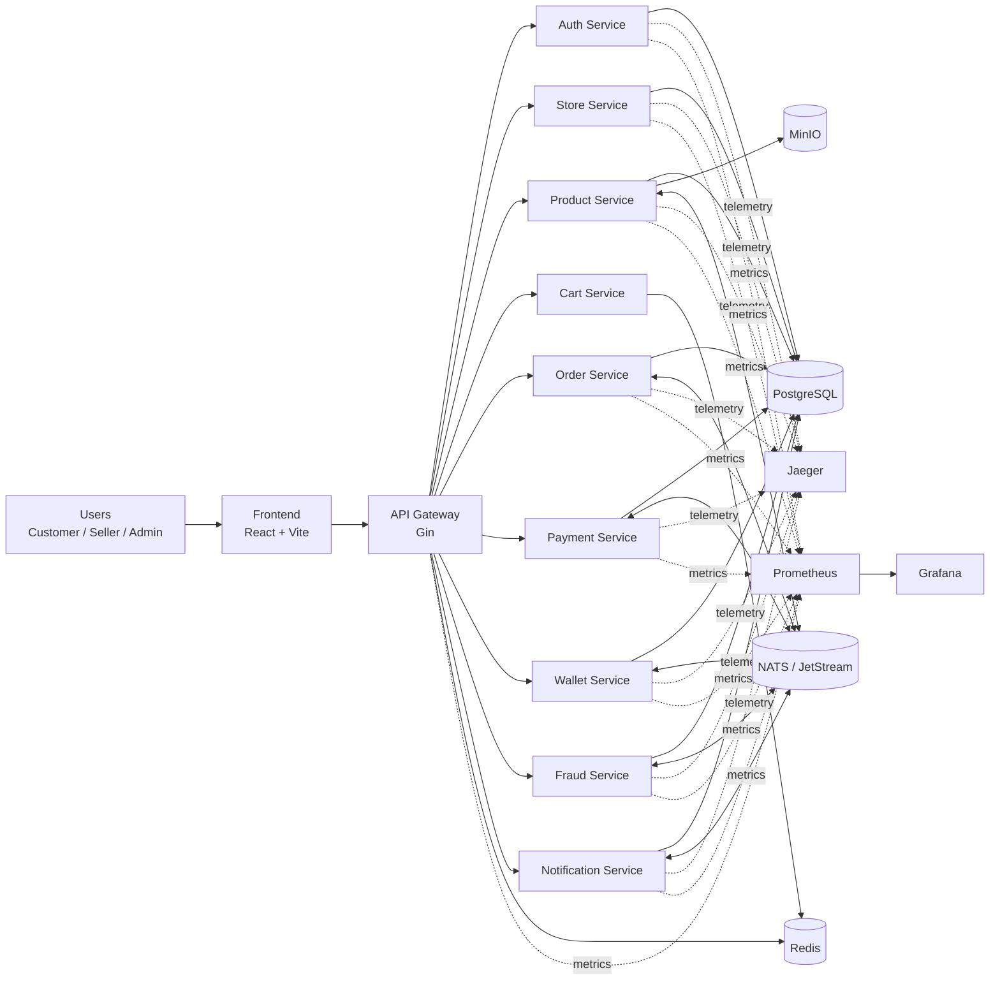
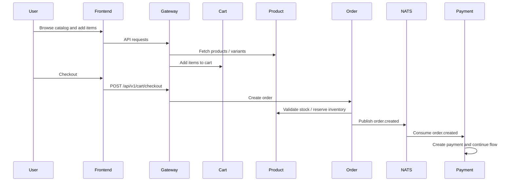
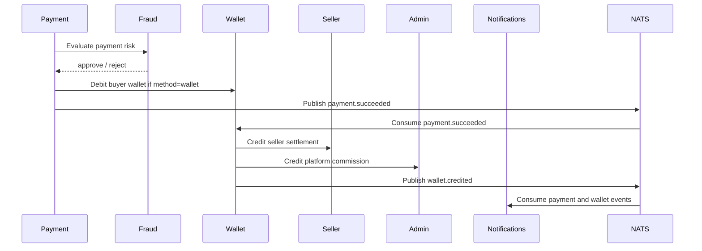
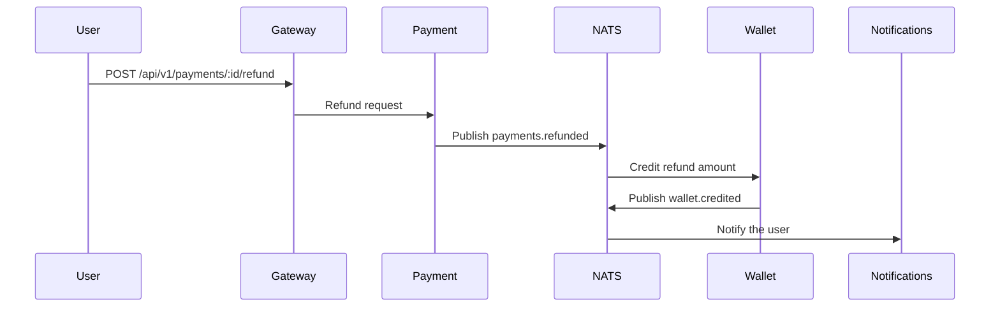

# Payflow

<p align="center">
  <strong>An event-driven marketplace and payment platform built with Go, React, NATS, PostgreSQL, Redis, and Docker Compose.</strong>
</p>

<p align="center">
  Payflow models the full commerce loop: identity, stores, products, carts, orders, payments, wallet settlement, platform commission, withdrawals, fraud checks, notifications, and observability.
</p>

## Why This Project Exists

Payflow is designed as a portfolio-ready microservices system that shows how a modern marketplace can be built around:

- API-first service boundaries
- asynchronous workflows over NATS / JetStream
- idempotent order and payment processing
- wallet-based settlement and refund handling
- admin tooling for risk, stores, users, and withdrawals
- a polished React frontend for customer, seller, and admin roles

It is not just a CRUD demo. It demonstrates how money movement, stock reservation, commission capture, and notifications can work together across independent services.

## What You Can Do

### Customer

- register and sign in
- browse stores and products
- add items to cart and checkout
- pay by card or wallet
- track orders and payments
- view wallet balance, top-ups, and refunds
- receive notifications

### Seller

- create and manage stores
- publish products and variants
- receive settlement into wallet
- request withdrawals
- monitor catalog and sales flows

### Admin

- review platform users and stores
- inspect fraud-related data
- approve or reject withdrawal requests
- view platform commission in the admin wallet
- monitor marketplace activity from the admin dashboard

## Stack

| Layer | Technology |
| --- | --- |
| Frontend | React 19, TypeScript, Vite, TanStack Query, React Router, Zustand |
| Backend | Go 1.26, Gin, Swagger |
| Messaging | NATS + JetStream |
| Datastores | PostgreSQL, Redis, MinIO |
| Observability | Prometheus, Grafana, Jaeger |
| Local Runtime | Docker Compose |

## System Architecture



## Core Runtime Flow

### 1. Browse to Checkout



### 2. Payment, Settlement, and Commission



### 3. Refund Handling



## Services

| Service | Port | Responsibility |
| --- | --- | --- |
| `api-gateway` | `8080` | Single frontend-facing API entrypoint, auth enforcement, reverse proxying, docs aggregation |
| `auth-service` | `8086` | Registration, login, tokens, role-aware identity |
| `store-service` | `8089` | Seller stores, commission settings, store metadata |
| `product-service` | `8087` | Product catalog, variants, inventory reservation, media via MinIO |
| `cart-service` | `8088` | Cart state and checkout preparation |
| `order-service` | `8081` | Order creation, state transitions, order event publishing |
| `payment-service` | `8082` | Payment orchestration, fraud gating, refund publishing |
| `wallet-service` | `8083` | Wallets, top-up, debit, settlement, commission credit, withdrawals |
| `fraud-service` | `8085` | Fraud checks and risk-related decisions |
| `notification-service` | `8084` | Notification persistence and event-driven user notifications |
| `frontend` | `5173` | Customer, seller, and admin UI |

## Infrastructure

| Component | Port | Purpose |
| --- | --- | --- |
| PostgreSQL | `55432` | Primary relational storage per service database |
| Redis | `6379` | Cart and fast-access state |
| NATS | `4222` | Event bus / JetStream |
| NATS Monitor | `8222` | NATS monitoring |
| NATS Leaf / extra port | `9222` | NATS auxiliary port exposed by compose |
| MinIO API | `9000` | Object storage for product assets |
| MinIO Console | `9001` | MinIO admin console |
| Prometheus | `9090` | Metrics scraping |
| Grafana | `3000` | Dashboards |
| Jaeger | `16686` | Distributed tracing UI |
| NATS UI | `31311` | NATS stream inspection |

## Local Setup

### Prerequisites

- Docker Desktop
- Docker Compose
- Node.js 22+ for local frontend work
- Go 1.26+ for local backend work

### Start With Docker Compose

The compose file uses profiles:

- `core` for infrastructure
- `app` for application services
- `obs` for observability tooling

Start infrastructure first:

```bash
docker compose -f backend/infra/docker-compose.yml --profile core up -d
```

Start the application stack:

```bash
docker compose -f backend/infra/docker-compose.yml --profile core --profile app up -d --build
```

Add observability when needed:

```bash
docker compose -f backend/infra/docker-compose.yml --profile core --profile app --profile obs up -d
```

### Sequential Build / Start

If you prefer bringing services up one by one instead of all at once:

```bash
docker compose -f backend/infra/docker-compose.yml --profile core up -d
docker compose -f backend/infra/docker-compose.yml --profile core --profile app up -d --build auth-service
docker compose -f backend/infra/docker-compose.yml --profile core --profile app up -d --build store-service
docker compose -f backend/infra/docker-compose.yml --profile core --profile app up -d --build product-service
docker compose -f backend/infra/docker-compose.yml --profile core --profile app up -d --build order-service
docker compose -f backend/infra/docker-compose.yml --profile core --profile app up -d --build wallet-service
docker compose -f backend/infra/docker-compose.yml --profile core --profile app up -d --build payment-service
docker compose -f backend/infra/docker-compose.yml --profile core --profile app up -d --build cart-service
docker compose -f backend/infra/docker-compose.yml --profile core --profile app up -d --build fraud-service
docker compose -f backend/infra/docker-compose.yml --profile core --profile app up -d --build notification-service
docker compose -f backend/infra/docker-compose.yml --profile core --profile app up -d --build api-gateway
docker compose -f backend/infra/docker-compose.yml --profile core --profile app up -d --build frontend
```

## Local Development

### Backend

```bash
cd backend
go test ./...
go fmt ./...
```

### Frontend

```bash
cd frontend
npm ci
npm run dev
```

## Demo Accounts

These seeded accounts are handy for showing the full marketplace loop locally:

| Role | Email | Password |
| --- | --- | --- |
| Customer | `codex-customer-1943@example.com` | `Passw0rd!123` |
| Seller | `codex-seller-1943@example.com` | `Passw0rd!123` |
| Admin | `codex-admin-1943@example.com` | `Passw0rd!123` |

## API Docs

Once the stack is running:

| Docs | URL |
| --- | --- |
| Gateway Swagger | `http://localhost:8080/swagger/index.html` |
| Auth Docs | `http://localhost:8080/docs/auth/index.html` |
| Orders Docs | `http://localhost:8080/docs/orders/index.html` |
| Payments Docs | `http://localhost:8080/docs/payments/index.html` |
| Wallet Docs | `http://localhost:8080/docs/wallet/index.html` |
| Products Docs | `http://localhost:8080/docs/products/index.html` |
| Stores Docs | `http://localhost:8080/docs/stores/index.html` |

## Observability

Payflow includes first-class operational tooling for local inspection:

- Prometheus metrics on each service
- Grafana dashboards for system health
- Jaeger tracing via OTLP
- NATS monitoring and UI for stream visibility
- service-level `/healthz` endpoints for runtime checks

## Repository Layout

```text
.
├── backend
│   ├── cmd              # service entrypoints
│   ├── infra            # docker-compose, prometheus, grafana, nats config
│   ├── internal         # domain logic, handlers, adapters, services
│   ├── migrations       # SQL schema and seed data
│   ├── pkg              # shared infrastructure code
│   └── scripts          # local helper scripts
├── frontend
│   ├── public
│   ├── src
│   │   ├── components
│   │   ├── lib
│   │   ├── pages
│   │   └── assets
│   └── Dockerfile
└── README.md
```

## Notable Implementation Details

- payments are event-driven, not hard-wired into synchronous request chains
- wallet settlement auto-provisions missing wallets before the first credit
- platform commission is credited into the admin/platform wallet during settlement
- frontend wallet views actively refresh instead of relying only on a full page reload
- product inventory and order processing support variant-aware ordering